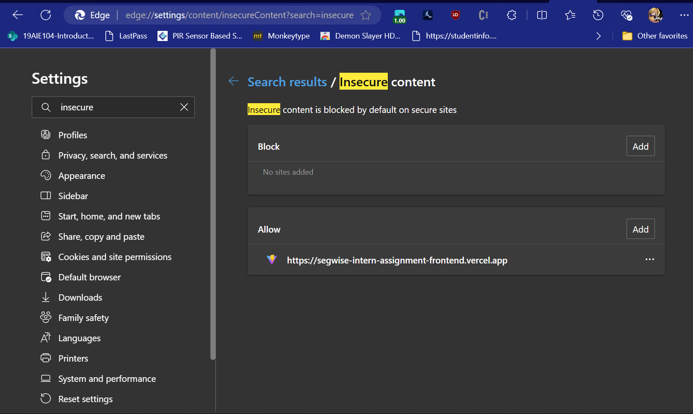
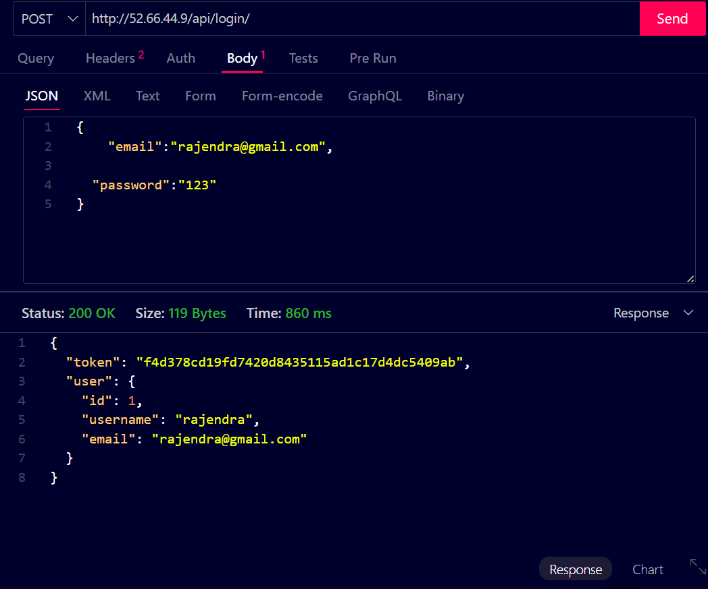
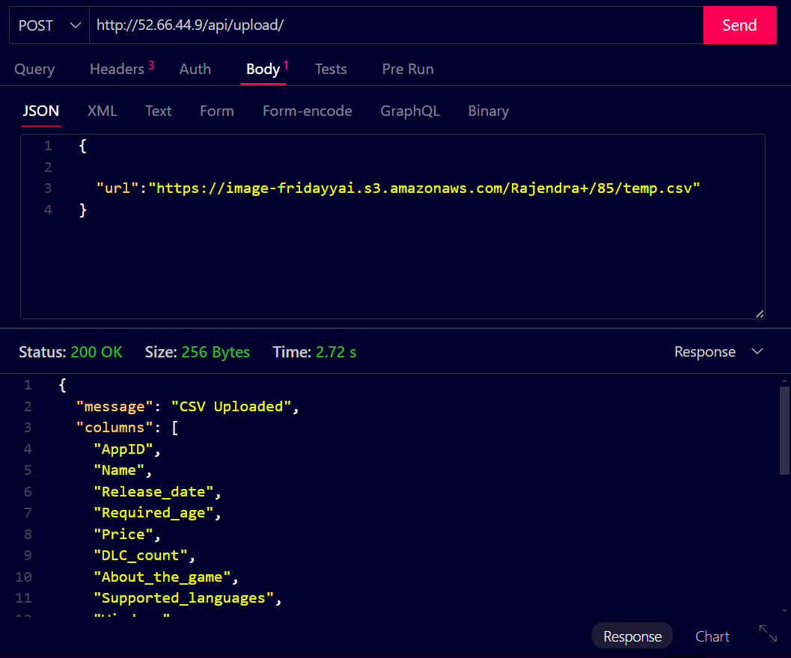
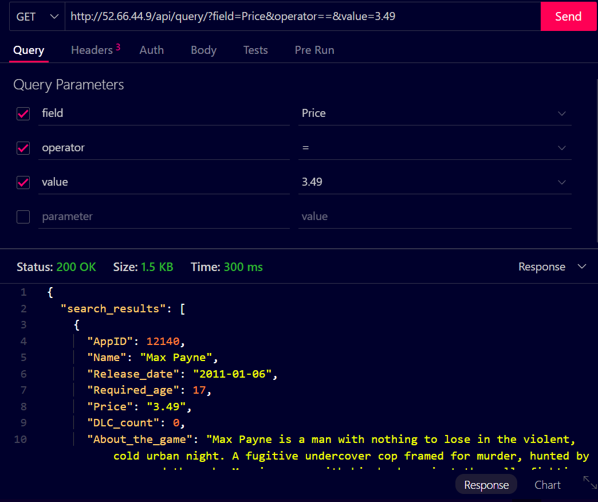
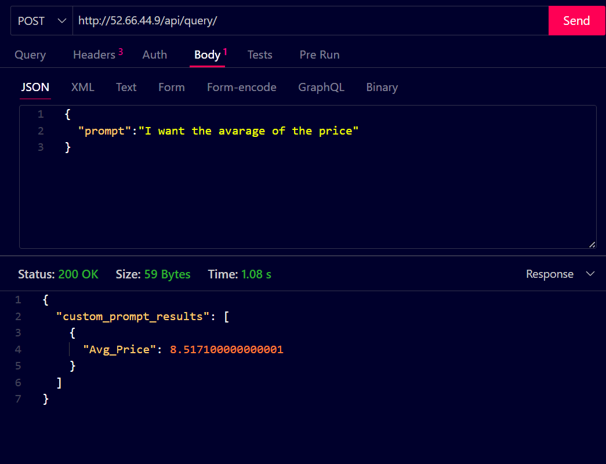

# LLM powered Data Analytics API

This Django-based REST API for game analytics allows users to upload CSV data containing game information and query this data using various filters and aggregations. In addition to this this API also allows the user to send custom prompts(In English) and get the desired results.

The API is deployed on AWS EC2 instance. Link: http://52.66.44.9/api 

The UI of this project is deployed at Link: https://segwise-intern-assignment-frontend.vercel.app

Note: The above link works only if you add the url link to the Allow Insecure Content sites of the browser
Example shown below


## Table of Contents

1. [Installation](#installation)
2. [API Endpoints](#api-endpoints)
3. [Authentication](#authentication)
4. [Docker Deployment](#docker-deployment)
5. [Usage Examples](#usage-examples)
6. [UI Demo](#demo)
7. [Example Query Screenshots](#example-screenshots)

## Installation

1. Clone the repository:
   ```
   git clone https://github.com/RajendraKumarVesapogu/segwise-intern-assignment.git
   cd segwise-intern-assignment
   ```

2. Create a virtual environment and activate it:
   ```
   python -m venv .venv
   source .venv/bin/activate  # On Windows use `.venv\Scripts\activate`
   ```

3. Install the required packages:
   ```
   pip install -r requirements.txt
   ```

4. Set up the database:

   ```
   python manage.py migrate --run-syncdb

   ```

5. Create a superuser (for admin access):
   ```
   python manage.py createsuperuser
   ```

6. Run the development server:
   ```
   python manage.py runserver
   ```

The API should now be accessible at `http://localhost:8000/`.


## API Endpoints

### Authentication Endpoints

1. **User Registration**
   - URL: `http://52.66.44.9/api/register/`
   - Method: POST

2. **User Login**
   - URL: `http://52.66.44.9/api/login/`
   - Method: POST

3. **User Logout**
   - URL: `http://52.66.44.9/api/logout/`
   - Method: POST

4. **Test Token**
   - URL: `http://52.66.44.9/api/test_token/`
   - Method: GET


### Data Analytics Endpoints

6. **Upload CSV**
   - URL: `http://52.66.44.9/api/upload/`
   - Method: POST

7. **Game Data Query**
   - URL: `http://52.66.44.9/api/query/`
   - Method: GET

8. **Custom Game Data Query**
   - URL: `http://52.66.44.9/api/query/`
   - Method: POST

## Authentication

This API uses Token authentication. To authenticate:

1. Register a new user or login to receive a token.
2. Include the token in the Authorization header for subsequent requests:
   ```
   Authorization: Token <your_token>
   ```

## Docker Deployment

Createed two docker images ( one with nginx and one without ) and pushed into the docker hub.

To deploy using Docker:

1. Build and run the services:
   ```
   docker-compose up --build
   ```

2. To run in the background:
   ```
   docker-compose up -d
   ```

3. To stop the services:
   ```
   docker-compose down
   ```

## Usage Examples

1. Register a new user:
   ```
   curl -X POST http://localhost:8000/register/ -H "Content-Type: application/json" -d '{"username":"newuser", "password":"newpassword"}'
   ```

2. Login and get token:
   ```
   curl -X POST http://localhost:8000/login/ -H "Content-Type: application/json" -d '{"username":"newuser", "password":"newpassword"}'
   ```

3. Upload CSV data:
   ```
   curl -X POST -H "Authorization: Token <your_token>" -H "Content-Type: application/json" -d '{"url":"https://example.com/game_data.csv"}' http://localhost:8000/upload/
   ```

4. Query game data:
   ```
   curl -H "Authorization: Token <your_token>" "http://localhost:8000/query/?field=Name&value=Half-Life"
   ```

5. Custom game data query:
   ```
   curl -X POST -H "Authorization: Token <your_token>" -H "Content-Type: application/json" -d '{"prompt":"Show me all games released after 2020"}' http://localhost:8000/query/
   ```
## Demo

Clone the frontend repository https://github.com/RajendraKumarVesapogu/segwise-intern-assignment-frontend.git

or
[Watch the video](https://youtu.be/XH_utAJ2Mx4)
<video controls src="readme-assets/2024-07-07 06-52-13.mp4" title="Title"></video>
## Example Screenshots

**User Registration**


**User Login**


**Upload CSV**
CSV link used for testing: https://image-fridayyai.s3.amazonaws.com/Rajendra+/85/temp.csv


**Query-GET**



**Query-Prompt**


For any issues or feature requests, please open an issue in the [GitHub repository](https://github.com/RajendraKumarVesapogu/segwise-intern-assignment).

or contact me rajendrakumarvesapogu@gmail.com